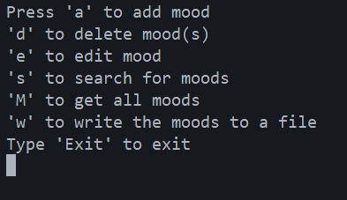
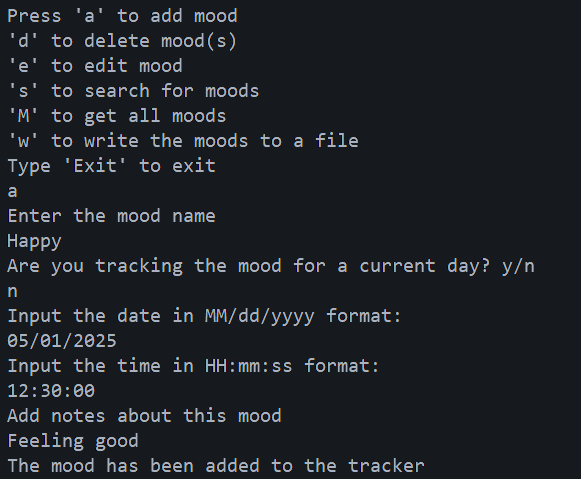
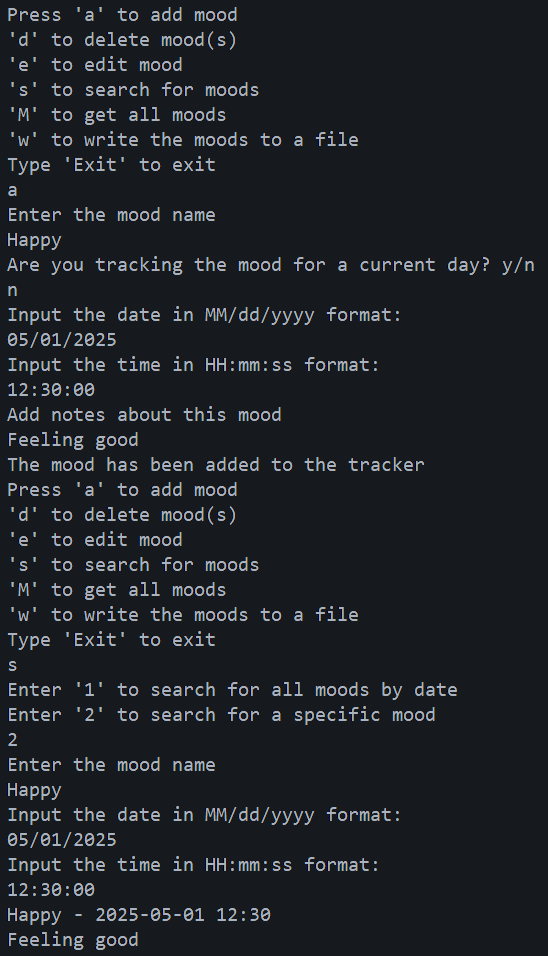
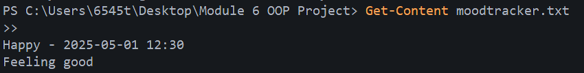

# MoodTracker Console App

## Overview
I built this project as the final assignment for my Object Oriented Programming in Java course. The goal was to demonstrate my understanding of core Java and OOP by creating a working console application that stores, searches, updates, deletes, and writes mood records to a file.

This project shows how I used classes and objects, constructor overloading, encapsulation, collections, date and time handling, exception handling, and file I/O in one small application.

## What This Project Demonstrates
- Creating a custom `Mood` class with attributes, constructors, getters, setters, `toString`, and equality checks
- Using an `ArrayList` to store objects in memory
- Parsing and validating `LocalDate` and `LocalTime` values
- Handling invalid input and duplicate mood entries with a custom exception
- Reading user input with `Scanner`
- Writing application data to `moodtracker.txt`

## Application Features
- Add a mood with a name, date, time, and optional notes
- Prevent duplicate moods for the same name, date, and time
- Edit notes for an existing mood
- Delete all moods for a specific date
- Delete one mood by name, date, and time
- Search moods by date
- Search for one mood by name, date, and time
- Display all stored moods
- Save all moods to a text file

## Project Structure
```text
src/
  Mood.java
  MoodTracker.java
  InvalidMoodException.java
classes/
  Mood.class
  MoodTracker.class
  InvalidMoodException.class
```

## How to Run
From the project root, compile the source files:

```powershell
javac -d classes src\*.java
```

Run the program:

```powershell
java -cp classes MoodTracker
```

## Menu Options
- `a` adds a new mood
- `d` deletes moods by date or deletes one specific mood
- `e` edits the notes for an existing mood
- `s` searches moods by date or by full details
- `M` prints all moods currently stored in memory
- `w` writes all moods to `moodtracker.txt`
- `Exit` closes the program

## Design Notes
I used `LocalDate` and `LocalTime` to track when each mood was recorded. I also added validation to prevent duplicate entries from being stored for the same mood name, date, and time. The custom `InvalidMoodException` is used to stop invalid records from being added.

The application stores data in memory during runtime and writes the current list to `moodtracker.txt` when requested. This keeps the program simple while still demonstrating file output.

## Screenshots
I can include screenshots of the main menu, a successful add operation, a successful search result, and the generated output file.

### Main Menu


### Add Mood


### Search Result


### File Output


## Summary
I created this project to apply the main topics from my Java OOP course in a practical way. It demonstrates class design, object handling, collections, date and time processing, exceptions, and file writing through a functional console-based mood tracker.
